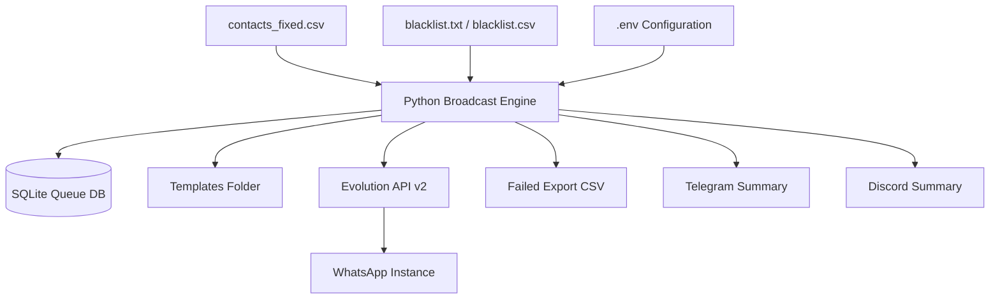

# 🚀 Evolution API Broadcast Engine


A queue-based WhatsApp broadcast runner built on top of **Evolution API v2**. This project is designed for **consent-based outbound messaging**, with support for:

- ✅ Queue + resume when a run stops unexpectedly
- ✅ Retry for failed deliveries
- ✅ Permanent-failure skip rules
- ✅ Per-day business hours
- ✅ Per-campaign allowed weekdays
- ✅ Randomized operational pacing
- ✅ Template rotation with **weighted random / random / round robin**
- ✅ Blacklist from `.txt` or `.csv`
- ✅ Auto export of failed records
- ✅ Telegram / Discord run summary
- ✅ File lock to prevent overlapping cron executions

---

## 📌 Disclaimer

This project is intended for **authorized, consent-based business messaging only**.

It is **not** intended to impersonate human behavior, bypass platform controls, or automate spam. Use it only for recipients who have explicitly opted in and only in accordance with your local regulations, business policies, and the platform rules that apply to your WhatsApp channel.

---

## 🧭 Overview

This engine reads recipient data from CSV, stores it in SQLite, prepares a campaign queue, and then sends messages through **Evolution API**.

It keeps track of each phone number per campaign and records whether the message is:

- `PENDING`
- `IN_PROGRESS`
- `FAILED`
- `SENT`
- `SKIPPED_BLACKLIST`
- `SKIPPED_PERMFAIL`

This makes the process restartable and auditable.

---

## 🏗️ Architecture



---

## 🗂️ Recommended Repository Structure

```text
broadcast-engine/
├── .env
├── .gitignore
├── README.md
├── requirements.txt
├── broadcast.py
├── contacts_fixed.csv
├── blacklist.txt
├── broadcast.sqlite
├── send_log.csv
├── failed_export.csv
├── templates/
│   ├── prod_a.txt
│   ├── prod_b.txt
│   └── prod_c.txt
└── docs/
    └── screenshots/
```

## ✅ Features

### Core messaging controls

- Supports **Evolution API v2** text sending
- Optional **presence/typing** before sending
- Link preview toggle
- Timeout and retry controls

### Queue engine

- Campaign queue stored in SQLite
- Resume after interruption
- Stale `IN_PROGRESS` recovery
- Per-record attempt count
- Permanent failure classification

### Operational controls

- Allowed weekdays per campaign
- Daily business hours per weekday
- Randomized interval between messages
- Randomized interval between batches
- Randomized batch size
- Cron-safe with file lock

### Compliance/safety controls

- Opt-in column check
- Do-not-contact column check
- Blacklist file support
- Permanent-failure skip rules
- Failed export after each run

### Reporting

- Local CSV send log
- SQLite attempt history
- Telegram run summary
- Discord run summary

---

## 📋 Prerequisites

Before starting, make sure you have:

- **Python 3.10+**
- **pip**
- A running **Evolution API v2** instance
- A connected WhatsApp instance in Evolution API
- A valid Evolution API key
- Linux or another environment that supports `fcntl` file locking

> Note: the script uses `fcntl` for process locking. That is standard on Linux/macOS. If you run on Windows, the lock implementation would need to be changed.

---

## 🔌 Evolution API Endpoints Used

This project is built around the official Evolution API v2 endpoints below:

- `POST /message/sendText/{instance}`
- `POST /chat/sendPresence/{instance}`

The official docs also describe webhook setup and additional integrations if you want to extend the project later.

### Official references

- Send Text: https://doc.evolution-api.com/v2/api-reference/message-controller/send-text
- Send Presence: https://doc.evolution-api.com/v2/api-reference/chat-controller/send-presence
- Webhooks configuration: https://doc.evolution-api.com/v2/pt/configuration/webhooks
- Releases: https://github.com/EvolutionAPI/evolution-api/releases

---

## 📦 Installation

### 1. Clone your repository

```bash
git clone https://github.com/YOUR_ORG/YOUR_REPO.git
cd YOUR_REPO
```

### 2. Create a virtual environment

```bash
python3 -m venv .venv
source .venv/bin/activate
```

### 3. Install dependencies

Create `requirements.txt`:

```txt
requests>=2.31.0
```

Then install:

```bash
python3 -m pip install -r requirements.txt
```

### 4. Add your files

Make sure the repository contains:

- `broadcast.py`
- `.env`
- `contacts_fixed.csv`
- `templates/*.txt`
- optional `blacklist.txt` or `blacklist.csv`

---

## ⚙️ Full Configuration Reference

All operational controls are intended to be set in **`.env` only**.

### Example `.env`

```env
# =========================
# Evolution API Connection
# =========================
EVO_BASE_URL=http://0.0.0.0:8080
EVO_API_KEY=GANTI_DENGAN_API_KEY_KAMU
EVO_INSTANCE=gudangpxxx

# =========================
# Safety guard
# =========================
DRY_RUN=1
ENABLE_SENDING=0

# =========================
# Environment / Campaign
# =========================
ENV_NAME=prod
CAMPAIGN_ID=2026-03-followup-01
CAMPAIGN_ALLOWED_DAYS=MON,TUE,WED,THU,FRI,SAT

# =========================
# Data Source
# =========================
CONTACTS_CSV=contacts_fixed.csv
CSV_DELIMITER=;
PHONE_COLUMN=phone
NAME_COLUMN=name
OPT_IN_COLUMN=opt_in
DNC_COLUMN=do_not_contact
OPT_IN_TRUE=yes,y,true,1
DNC_TRUE=yes,y,true,1
PHONE_MIN_LEN=10
PHONE_MAX_LEN=16

DB_PATH=broadcast.sqlite
LOG_CSV=send_log.csv
LOCK_FILE_PATH=/tmp/evo_broadcast.lock

# =========================
# Message Templates
# =========================
TEMPLATE_SELECTION=weighted_random
TEMPLATE_SPECS=templates/prod_a.txt:70,templates/prod_b.txt:20,templates/prod_c.txt:10

# =========================
# Evolution send behavior
# =========================
REQUEST_TIMEOUT_S=30
HTTP_RETRY_COUNT=2
HTTP_RETRY_BACKOFF_S=2
EVO_SENDTEXT_DELAY_MS=1000
EVO_LINK_PREVIEW=0
EVO_USE_PRESENCE=0
EVO_PRESENCE_TYPE=composing
EVO_PRESENCE_DELAY_MS=1200
EVO_POST_PRESENCE_SLEEP_S=0.3

# =========================
# Resume / Retry / Queue
# =========================
MAX_ATTEMPTS=5
RETRY_FAILED=1
LOCK_STALE_MINUTES=20
PERMFAIL_HTTP_CODES=400,401,403,404
PERMFAIL_ERROR_SUBSTRINGS=invalid number,not on whatsapp,unauthorized,forbidden,not found,bad request

# =========================
# Working hours per day
# =========================
BUSINESS_HOURS_ENABLED=1
WAIT_FOR_WINDOW=0

BUSINESS_MON_ENABLED=1
BUSINESS_MON_START=09:00
BUSINESS_MON_END=17:00

BUSINESS_TUE_ENABLED=1
BUSINESS_TUE_START=09:00
BUSINESS_TUE_END=17:00

BUSINESS_WED_ENABLED=1
BUSINESS_WED_START=09:00
BUSINESS_WED_END=17:00

BUSINESS_THU_ENABLED=1
BUSINESS_THU_START=09:00
BUSINESS_THU_END=17:00

BUSINESS_FRI_ENABLED=1
BUSINESS_FRI_START=09:00
BUSINESS_FRI_END=17:00

BUSINESS_SAT_ENABLED=1
BUSINESS_SAT_START=09:00
BUSINESS_SAT_END=13:00

BUSINESS_SUN_ENABLED=0
BUSINESS_SUN_START=00:00
BUSINESS_SUN_END=00:00

# =========================
# Pacing operasional
# =========================
PER_MSG_MIN_S=300
PER_MSG_MAX_S=480
BATCH_SIZE_MIN=10
BATCH_SIZE_MAX=15
BATCH_MIN_S=900
BATCH_MAX_S=1800
MAX_PER_RUN=50

# =========================
# Blacklist
# =========================
BLACKLIST_ENABLED=1
BLACKLIST_FILE=blacklist.txt
BLACKLIST_FILE_TYPE=auto
BLACKLIST_CSV_DELIMITER=;
BLACKLIST_CSV_COLUMN=phone

# =========================
# Failed export
# =========================
FAILED_EXPORT_AUTO=1
FAILED_EXPORT_CSV=failed_export.csv
FAILED_EXPORT_TIMESTAMPED=1
FAILED_EXPORT_STATUSES=FAILED,SKIPPED_PERMFAIL,SKIPPED_BLACKLIST

# =========================
# Telegram report
# =========================
REPORT_TELEGRAM_ENABLED=0
REPORT_TELEGRAM_BOT_TOKEN=
REPORT_TELEGRAM_CHAT_ID=

# =========================
# Discord report
# =========================
REPORT_DISCORD_ENABLED=0
REPORT_DISCORD_WEBHOOK_URL=
```

---

## 🧾 Contacts CSV Format

Example `contacts_fixed.csv`:

```csv
phone;name;opt_in;do_not_contact
081234567890;John;yes;no
081298765432;Mary;yes;no
081200000000;Blocked User;yes;yes
```

### Required columns

| Column | Purpose |
|---|---|
| `phone` | Destination number |
| `name` | Recipient name |
| `opt_in` | Must match one of `OPT_IN_TRUE` |
| `do_not_contact` | If matches one of `DNC_TRUE`, the row will be skipped |

The phone number will be normalized automatically:

- `081234567890` → `6281234567890`
- `+6281234567890` → `6281234567890`

---

## 📨 Template Files

Create templates in the `templates/` folder.

### Example `templates/prod_a.txt`

```txt
Hello {{name}},

This is a follow-up from our team regarding your request.
Please reply to this message if you would like us to continue.
```

### Example with spintext

```txt
{{spintext:Hello|Hi|Good day}} {{name}},

We are following up on your request.
{{spintext:Please reply if you need help.|Let us know if you would like assistance.}}
```

### Supported placeholders

- `{{name}}`
- `{{phone}}`
- any other CSV column, for example `{{city}}`, `{{order_id}}`, `{{branch}}`

### Template selection modes

| Mode | Behavior |
|---|---|
| `round_robin` | Templates rotate in order |
| `random` | Templates are selected randomly with equal probability |
| `weighted_random` | Templates are selected randomly using the weight defined in `TEMPLATE_SPECS` |

Example weighted setup:

```env
TEMPLATE_SELECTION=weighted_random
TEMPLATE_SPECS=templates/prod_a.txt:70,templates/prod_b.txt:20,templates/prod_c.txt:10
```

This means:

- `prod_a.txt` is selected most often
- `prod_b.txt` less often
- `prod_c.txt` least often

---

## 🚫 Blacklist Support

Blacklist can be loaded from either:

- `.txt`
- `.csv`

### Example `blacklist.txt`

```txt
6281111111111
6282222222222
6283333333333
```

### Example `blacklist.csv`

```csv
phone;reason
6281111111111;manual block
6282222222222;do not contact
```

If a recipient matches the blacklist, the queue status becomes:

- `SKIPPED_BLACKLIST`

---

## 🔁 Queue, Resume, Retry, and Permanent Failures

### Queue lifecycle

Each recipient in a campaign can move through these statuses:

- `PENDING`
- `IN_PROGRESS`
- `FAILED`
- `SENT`
- `SKIPPED_BLACKLIST`
- `SKIPPED_PERMFAIL`

### Resume behavior

If the script stops unexpectedly while a record is `IN_PROGRESS`, the next run will recover it if it stays stale longer than:

```env
LOCK_STALE_MINUTES=20
```

### Retry behavior

Failed records can be retried automatically until:

```env
MAX_ATTEMPTS=5
```

### Permanent failure rules

If a response matches a permanent fail rule, the engine stops retrying that recipient and marks it as:

- `SKIPPED_PERMFAIL`

Configured by:

```env
PERMFAIL_HTTP_CODES=400,401,403,404
PERMFAIL_ERROR_SUBSTRINGS=invalid number,not on whatsapp,unauthorized,forbidden,not found,bad request
```

---

## ⏰ Scheduling and Allowed Days

There are **two scheduling layers**:

### 1. Campaign allowed days

```env
CAMPAIGN_ALLOWED_DAYS=MON,TUE,WED,THU,FRI,SAT
```

If today is not included, the campaign will not run.

### 2. Business hours per weekday

Example:

- Monday–Friday: 09:00–17:00
- Saturday: 09:00–13:00
- Sunday: disabled

### What happens outside the window?

Controlled by:

```env
WAIT_FOR_WINDOW=0
```

- `0` → exit immediately
- `1` → wait until the next valid sending window

---

## 🕒 Operational Pacing

This project supports randomized sending intervals for **operational smoothing**.

### Message-level delay

```env
PER_MSG_MIN_S=300
PER_MSG_MAX_S=480
```

This means the script waits **5 to 8 minutes** between messages.

### Batch size

```env
BATCH_SIZE_MIN=10
BATCH_SIZE_MAX=15
```

This means one batch may send 10 messages, another batch may send 12, another may send 15, and so on.

### Batch pause

```env
BATCH_MIN_S=900
BATCH_MAX_S=1800
```

This means the script pauses **15 to 30 minutes** between batches.

### Evolution internal send delay

```env
EVO_SENDTEXT_DELAY_MS=1000
```

This is different from the batch/message pacing above. It is the internal delay parameter passed to Evolution API’s `sendText` endpoint.

---

## ▶️ Execution

### Import contacts into SQLite

```bash
python3 broadcast.py import
```

### Show queue summary

```bash
python3 broadcast.py summary
```

### Export current failed/skipped list manually

```bash
python3 broadcast.py export_failed
```

### Run the broadcast engine

```bash
python3 broadcast.py send
```

---

## 🧪 Safe Testing Workflow

Use this sequence when deploying for the first time.

### Step 1 — Dry run mode

```env
DRY_RUN=1
ENABLE_SENDING=0
```

Run:

```bash
python3 broadcast.py send
```

This prints messages, queue behavior, and scheduling logic without sending real messages.

### Step 2 — Enable live sending

```env
DRY_RUN=0
ENABLE_SENDING=1
```

Run:

```bash
python3 broadcast.py send
```

---

## 📊 Log Output Example

A real run will print lines like this:

```text
[QUEUE #3/20] phone=6281234567890 name=John queue_status=FAILED next_attempt=2 template=templates/prod_b.txt weight=20
[SEND #3] phone=6281234567890 name=John http=201 result=SENT attempt=2
[WAIT] per-message pause 376s (msg_in_batch=4/12)
```

You can see:

- recipient name
- phone number
- queue status before processing
- next attempt number
- selected template
- template weight
- HTTP response code
- final result
- next wait duration

---

## 📤 Failed Export

After each run, the engine can automatically export selected statuses to CSV.

Configured by:

```env
FAILED_EXPORT_AUTO=1
FAILED_EXPORT_CSV=failed_export.csv
FAILED_EXPORT_TIMESTAMPED=1
FAILED_EXPORT_STATUSES=FAILED,SKIPPED_PERMFAIL,SKIPPED_BLACKLIST
```

Example output file:

```text
failed_export_20260308_101500.csv
```

Columns included:

- `phone`
- `name`
- `status`
- `attempts`
- `last_status_code`
- `last_response_text`
- `last_attempt_at`
- `sent_at`
- `template_used`

---

## 📣 Reporting

### Telegram summary

Enable in `.env`:

```env
REPORT_TELEGRAM_ENABLED=1
REPORT_TELEGRAM_BOT_TOKEN=YOUR_BOT_TOKEN
REPORT_TELEGRAM_CHAT_ID=YOUR_CHAT_ID
```

### Discord summary

Enable in `.env`:

```env
REPORT_DISCORD_ENABLED=1
REPORT_DISCORD_WEBHOOK_URL=https://discord.com/api/webhooks/...
```

The run summary includes:

- run ID
- campaign ID
- environment
- processed count
- queue counts by status
- failed export path if generated

---

## 🔐 Cron Safety / Overlap Prevention

This project uses a **file lock** so two cron executions cannot run simultaneously.

Configured by:

```env
LOCK_FILE_PATH=/tmp/evo_broadcast.lock
```

If another process is already running, the new process exits immediately.

---

## 🧰 Troubleshooting

### 1. No message is being sent

Check:

- `DRY_RUN`
- `ENABLE_SENDING`
- `CAMPAIGN_ALLOWED_DAYS`
- `BUSINESS_*` settings
- recipient `opt_in` value
- recipient `do_not_contact` value
- blacklist file

### 2. Messages stay in `FAILED`

Check:

- Evolution API base URL
- API key
- instance name
- instance connection state
- permanent-failure rules
- request timeout

### 3. The script exits immediately

Possible reasons:

- current day is not allowed by `CAMPAIGN_ALLOWED_DAYS`
- current time is outside business hours
- another process already holds the lock file

### 4. Blacklist is ignored

Check:

- `BLACKLIST_ENABLED=1`
- file path is correct
- delimiter and column name match the file
- numbers are normalized consistently

### 5. Telegram or Discord report is not delivered

Check:

- token / chat ID / webhook URL
- outbound internet access from the host
- bot permissions or Discord channel permissions

---

## 🔒 Security Notes

### Do not commit secrets

Add a `.gitignore` file like this:

```gitignore
.env
.venv/
__pycache__/
*.pyc
broadcast.sqlite
send_log.csv
failed_export*.csv
cron.log
```

### Rotate exposed credentials

If an API key has ever been shared in chat, email, or screenshots, rotate it immediately.

### Protect personal data

If you store customer phone numbers or names in the repository or logs, make sure that matches your internal data handling policy.

---

## 📘 Recommended Operational Checklist

Before production use:

- [ ] Evolution API instance is connected
- [ ] `.env` reviewed and validated
- [ ] `DRY_RUN=1` tested successfully
- [ ] Templates reviewed for compliance and clarity
- [ ] Opt-in data verified
- [ ] Blacklist verified
- [ ] Business hours verified
- [ ] Telegram/Discord summary tested
- [ ] Cron entry tested with lock behavior
- [ ] Failed export file generated successfully

---

## 📚 References

This project is aligned with the current Evolution API documentation and release references below:

- Evolution API Send Text endpoint: https://doc.evolution-api.com/v2/api-reference/message-controller/send-text
- Evolution API Send Presence endpoint: https://doc.evolution-api.com/v2/api-reference/chat-controller/send-presence
- Evolution API Webhooks configuration: https://doc.evolution-api.com/v2/pt/configuration/webhooks
- Evolution API latest release page: https://github.com/EvolutionAPI/evolution-api/releases

As of the current release page, **v2.3.7** is listed as the latest release. If you upgrade later, review the official release notes before changing behavior in production.

---

## ✍️ Suggested README Title Alternatives

If you want a more polished GitHub presentation, here are good title options:

- **Evolution API Broadcast Engine**
- **Queue-Based WhatsApp Broadcast Runner for Evolution API**
- **Operational WhatsApp Broadcast Orchestrator (Evolution API v2)**
- **Consent-Based Messaging Engine for Evolution API**

---

## 🧱 Suggested Next Repository Assets

To make the GitHub repository complete, consider adding:

- `docs/screenshots/queue-summary.png`
- `docs/screenshots/dry-run-example.png`
- `docs/screenshots/env-example.png`
- `docs/architecture.md`
- `docs/runbook.md`
- `docs/faq.md`

---

## ✅ Final Notes

This project is designed to be:

- restartable
- auditable
- operationally controlled
- configurable from `.env`
- safe to schedule with cron

For production use, keep your templates transparent, your recipient list consent-based, and your credentials protected.
